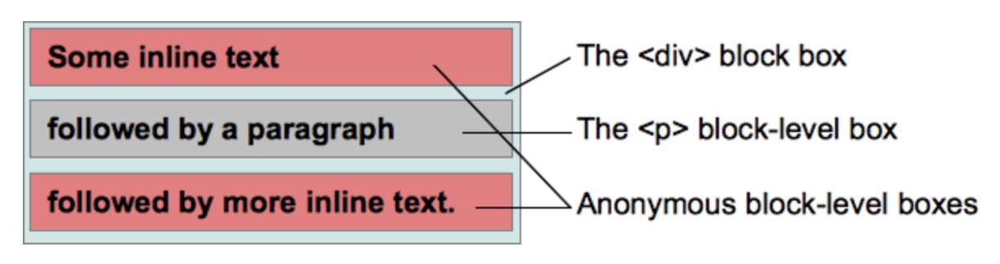
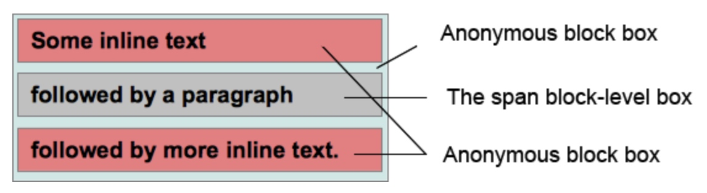

# 8 视觉格式化模型（Visual formatting model）
术语：
1. 块：`block`，一个抽象的概念，一个块在文档流上占据一个独立的区域。块与块之间在垂直方向上按照顺序堆叠
2. 包含块：`containing block`，包含其它盒子的块称为 包含块
3. 盒子：`box`，一个抽象的概念，由 CSS 引擎根据文档中的内容所创建，主要用于文档元素的定位、布局、格式化等用途
    + 盒子与元素不是一一对应的。有时多个元素会合并生成一个盒子，有时一个元素会生成多个盒子（如匿名盒子）
4. 块级元素：`block-level element`，元素的 `display` 为 `block`、`list-item`、`table` 时，该元素将成为块级元素
    + 元素是否是块级元素 仅是 元素本身的属性，并不直接用于格式化上下文的创建或布局
5. 块级盒子：`block-level box`，由块级元素生成。一个块级元素至少会生成一个块级盒子，但也可能生成多个（例如列表项元素）
6. 块容器盒子：`block container box` 或 `block containing box`，块容器盒子侧重于当前盒子作为 **容器** 的角色，它不参与当前块的布局和定位，所描述的仅仅是当前盒子与其后代之间的关系
    + 换句理解：块容器盒子主要用于确定子元素的定位、布局等
7. 块盒子：`block box`，如果一个元素同时是块级盒子和块容器盒子，可以称其为块盒子
    + 块盒子有两类，一类是具名块盒子，另一类匿名块盒子（Anonymous block box）。匿名块盒子无法被 CSS 选择器选中
    + 小结：盒子分为 **块盒子** 和 **块级盒子** 两种，但元素只有 **块级元素** 无 **块元素**


8. 行内级元素：`inline-level element`，元素的 `display` 为 `inline`、`inline-block`、`inline-table` 的元素称为行内级元素
    + 元素是否是行内级元素 仅是 元素本身的属性，并不直接用于格式化上下文的创建或布局
9. 行内级盒子：`inline-level box`，由行内级元素生成。
    + 行内级盒子分为行内盒子和原子行内盒子。区别在于该盒子是否参与行内格式化上下文的创建
10. 行内盒子：`inline-box`，参与行内格式化上下文创建的行内盒子称为行内盒子
    + 行内盒子有两类，具名行内盒子和匿名行内盒子
11. 原子行内级盒子：`atomic inline-level box`，不参与行内格式化上下文创建的行内盒子称为行内级盒子
    + 原子行内级盒子一开始叫做原子行内盒子（atomic inline box），后被修正
    + 原子行内级盒子的内容不会拆分成多行显示

## 8.1 概念
1. 定义：CSS 视觉格式化模型 是一种处理文档并将其显示在可视媒体上的算法
2. 盒子创建的决定因素：视觉格式化模型会根据 **CSS盒子模型** 将文档中的元素转换为一个个盒子。每个盒子的布局由以下因素决定
    1. 盒子的尺寸：精确指定、由约束条件指定、没有指定
    2. 盒子的类型：行内盒子（line）、行内级盒子（line-level）、原子行内级盒子（atomic inline level）、块盒子（block）
    3. 定位方案：普通流定位、浮动定位、绝对定位
    4. 文档树中的其它元素：即当前盒子的子元素或兄弟元素
    5. 视口尺寸和位置
    6. 包含的图片的尺寸
    7. 其它的外部因素

3. 模型会根据 **盒子的包含块（containing block）的边界** 来渲染盒子
    + 通常，盒子会创建一个 包含其后代元素 的包含块，但盒子不由包含块所限制。当盒子的布局跑到包含块的外面时称为 溢出(overflow)

## 8.2 盒子的生成
1. 盒子的生成是 CSS 视觉格式化模型的一部分，用于从文档元素生成盒子。
2. 盒子有不同的类型，不同类型的盒子格式化方法也不同。
3. 盒子的类型取决于 `display` 属性

### 8.2.1 块级元素与块盒子
1. 当元素的 `display` 为 `block`、`list-item`、`table` 时，该元素将成为块级元素
2. 一个块级元素会被格式化成一个块(比如 段落)，默认按垂直方向依次排列
3. 每个块级盒子都会参与 **块格式化上下文** 的创建，而每个块级元素都会至少生成一个块级盒子（即主块级盒子）
    + 有些元素，比如列表项，会生成额外的盒子来放置项目符号，而那些生成列表项的元素可能生成更多的盒子
    + 多数元素通常只生成一个主块级盒子
#### 8.2.1.1 主块级盒子
1. 主块级盒子包含由后代元素生成的盒子及其内容，同时也参与定位方案
2. 一个块级盒子可能也是一个块容器盒子
    + 块容器盒子要么**只包含其它块级盒子**，要么**只包含行内盒子并同时创建一个行内格式化上下文**
    + 块级盒子和块容器盒子是不同的
        - 块级盒子描述了元素与其父元素和兄弟元素之间的行为
        - 块容器盒子描述了元素跟其后代之间的行为
    + 有些块级盒子不是块容器盒子，比如表格
    + 有些块容器盒子也不是块级盒子，比如非替换行内块和非替换表格单元格

#### 8.2.1.2 块盒子
1. 概念：块级盒子是块容器盒子的时候就叫块盒子

##### 8.2.1.2.1 匿名块盒子
1. 概念：在某些情况下进行视觉格式化时，需要添加一些增补性的盒子，这些盒子不能用 CSS 选择器，因此称为匿名盒子
2. CSS 选择器不能用于匿名盒子，所以它不能被样式表赋予样式
    + 此时所有可继承的 CSS 属性值都为 `inherit`
    + 此时所有不可继承的 CSS 属性值都为 `initial`
3. 块包含盒子可能只包含行内级盒子，也可能只包含块级盒子
    + 通常，文档中都会包含其两者，这种情况下，就会在相邻的行内级盒子外创建匿名块盒子
    
##### 8.2.1.2.2 匿名块盒子的示例
###### 8.2.1.2.2.1 示例1
1. 示例：如下 HTML 代码，`<div>` 和 `<p>` 都保持默认的样式（即 `display` 为 `block`）

    ```html
    <div>Some inline text <p>followed by a paragraph</p> followed by more inline text.</div>
    ```    
2. 分析：此时会产生两个匿名块盒子（一个是 `<p>` 元素之前的 `Some inline text`，另一个是 `<p>` 元素之后的 `followed by more inline text`）
    
    - 显示为： 

        ```
        Some inline text
        followed by a paragraph
        followed by more inline text
        ```
    - 对这两个匿名盒子来说，程序员无法像 `<p>` 那样控制它们的样式，因此会从 `<div>` 那里继承那些可继承的属性（如 `color`），不可继承的属性设置为 `inital`（比如 `background-color`，因此具有默认透明的背景）。`<p>` 的盒子是能够使用 CSS 指定背景颜色的，类似地，两个匿名块盒子的文本颜色总是一样的

###### 8.2.1.2.2.2 示例2
1. 场景：创建匿名块盒子的另一种情况
    - 一个行内盒子中包含一或多个块盒子
        + 此时包含块盒子的盒子会拆分为两个行内盒子，分别位于块盒子的前面和后面
        + 块盒子前面的所有行内盒子会被一个匿名块盒子包裹，块盒子后面的行内盒子也是一样
        + 因此，块盒子将成为这两个匿名块盒子的兄弟盒子
    - 多个块盒子，并且之间没有行内元素
        + 这些盒子的前面和后面创建两个匿名块盒子
2. 示例：如下 HTML 代码，`<p>` 的 `display` 为 `inline`，`span` 的 `display` 为 `block`
    
    ```html
    <p>
        Some <em>inline</em> text 
        <span>followed by a paragraph</span> followed by more inline text.
    </p>
    ```

3. 分析：此时会产生两个匿名块盒子(一个是 `<span>` 元素前面的文本 `Some inline text`，另一个是 `<span>` 后面的文本 `followed by more inline text.`)
    
    - 显示为：   
        ```
        Some inline text
        followed by a paragraph
        followed by more inline text.
        ```

### 8.2.2 行内级元素与行内盒子 
1. 当元素的 `display` 为 `inline`、`inline-block`、`inline-table` 时，该元素将成为行内级元素
2. 显示时，它不会生成内容块，但可以与其他行内级内容一起显示为多行
    + 典型例子：包含多种格式内容（如强调内容、图片）的段落，可由行内级元素组成

3. 行内级元素会生成行内级盒子，该盒子同时会参与行内格式化上下文的创建
4. 行内盒子即是行内级盒子，也是一个其内容会参与创建其容器的行内格式化上下文的盒子
    + 比如所有具有 `display: line` 样式的非替换盒子
5. 一个行内级盒子的内容不参与行内格式化上下文的创建，称 **原子行内级盒子**
6. 替换行内级元素 或 `display 为 inline-block 或 inline-table` 的元素创建的盒子不会像行内盒子一样被拆分为多个盒子

#### 8.2.2.1 原子行内级盒子
1. 现象：在同一个行内格式化上下文中，原子行内级盒子不能拆分成多行
    - `display` 为 `inline`

        ```html
        <style>
          span {
            display:inline; /* default value*/
          }
        </style>
        <div style="width:20em;">
           The text in the span <span>can be split in several
           lines as it</span> is an inline box.
        </div>
        ```
        可能显示为：

        ```css
        The text in the span can be split into several
        lines as it is an inline box.
        ```
    - `display` 为 `inline-block`
    
        ```html
        <style>
          span {
            display:inline-block;
          }
        </style>
        <div style="width:20em;">
           The text in the span <span>cannot be split in several
           lines as it</span> is an inline-block box.
        </div>
        ```
        可能显示为(`cannot be split into several lines as it is an`永远不会换行)：
        
        ```css
        The text in the span 
        cannot be split into several lines as it is an
        inline-block box.
        ```
        
#### 8.2.2.2 匿名行内盒子
1. 现象：类似块盒子，CSS 引擎也会创建一些行内盒子。行内盒子无法被选择符选中，因此是匿名的，从父元素继承可继承属性，其它属性为 `initial`
2. 常见的情况：CSS 引擎会自动为直接包含在块盒子中的文本创建一个 行内格式化上下文，在这种情况下，这些文本会被一个 足够大的匿名行内盒子 所包含
    - 若只包含空格，可能不生成匿名行内盒子，因为 空格 可能被 `white-space` 移除，从而导致最终内容为空

### 8.3 定位方案
- 一旦盒子生成，CSS 引擎需要定位它们以完成布局，采用以下的方案
    1. 普通流：按照次序依次定位每个盒子
    2. 浮动：将盒子从普通流中单独拎出来，将其放到外层盒子的某一边
    3. 绝对定位：按照绝对位置来定位盒子，其位置根据盒子的包含元素所建立的绝对坐标系来计算，因此绝对定位元素有可能会覆盖其他元素

#### 8.3.1 普通流
1. 在普通流中，盒子依次放置
2. 在块格式化上下文中，盒子在垂直方向依次排列
3. 在行内格式化上下文中，盒子水平排列
4. 当 CSS 的 `position` 属性为 `static` 或 `relative`，并且 `float` 属性不为 `none` 时，其布局方式为普通流


#### 8.3.2 浮动
1. 在浮动定位中，浮动盒子会浮动到当前行的开始或尾部位置。这会导致普通流中的文本及其它内容会流到浮动盒子的边缘处，除非元素通过 clear 清除了前面的浮动
2. 一个盒子的 `float` 值为 `none`，并且 `position` 不为 `static` 或 `relative` 时，该盒子为 浮动定位
    + `float` 为 `left`，浮动盒子会定位到 当前行盒子 的开始位置（左侧）
    + `float` 为 `right`，浮动盒子会定位到 当前行盒子 的尾部位置（右侧）
    + 不管左浮动或右浮动，行盒子都会伸缩以适应浮动盒子的大小

#### 8.3.3 绝对定位
1. 在绝对定位中，盒子会完全从当前流中移除，并且不会再与其有任何联系（此处指定位和位置计算，而绝对定位元素在文档树仍与其他元素有父子或兄弟等关系）
    + 其位置会使用 `top`、`bottom`、`left`、`right` 相对其 **包含块** 进行计算
2. 元素的 `position` 为 `absolute` 或 `fixed`，为绝对定位
3. 对固定位置的元素来说，其包含块为整个视口，该元素相对视口进行绝对定位，因此滚动时元素的位置并不会改变


