## 1 Grid 布局
CSS 网格布局 (Grid Layout) 是 CSS 中最强大的布局系统。Flex 布局主要针对一维布局，而 Grid 布局针对二维布局

## 2 兼容性
[https://caniuse.com/#feat=css-grid](https://caniuse.com/#feat=css-grid)

## 3 基本概念
### 3.1 Grid Container（网格容器）
概念：**设置了 `display: grid` 的元素**

这是所有 **Grid Item** 的直接父元素。举个栗子：

```html
<div class="grid-container">
    <div class="grid-item">
        <div class="item1"></div>
    </div>
    <div class="grid-item">
        <div class="item2"></div>
    </div>
</div>
```

```css
.grid-container {
  display: grid
}
```

### 3.2 Grid Item（网格元素）
概念：**网格容器(Grid Container) 的直接子元素**，详细点来说其实就是 网格单元

如 .item1, .item2 不是网格元素，举个栗子：

```html
<div class="grid-container">
    <div class="grid-item">
        <div class="item1"></div>
    </div>
    <div class="grid-item">
        <div class="item2"></div>
    </div>
</div>
```
```css
.grid-container {
  display: grid
}
```

### 3.3 Grid Line（网格线）
概念：**构成网格结构的分界线**

可以是垂直方向或者水平方向，并位于行或列的任一侧。
下图中的黄线即为 列网格线：

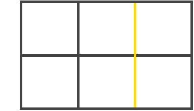

### 3.4 Grid Track（网格轨道）
概念：**两个相邻网格线之间的空间**

可想象成网格的列或行
下面是第二行和第三行网格线之间的网格轨道：

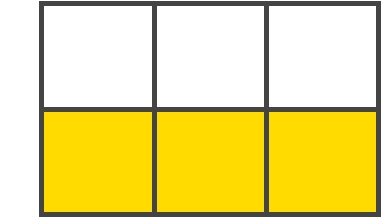

### 3.5 Grid Cell（网格单元）
概念：**两个 *相邻的行* 和两个 *相邻的列* 网格线之间的空间，这是网格里一个单独的单元**

如下图：

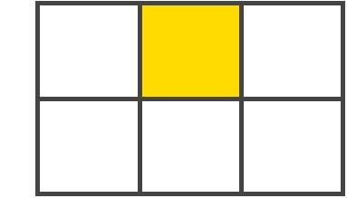

### 3.6 Grid Area（网格区域）
概念：**四个网格线包围的总空间，可由任意数量的网格单元组成**

如下图：
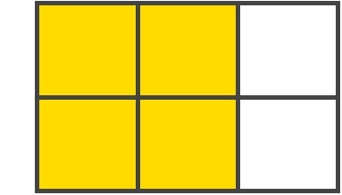

## 4 网格属性列表
### 4.1 网格容器（Grid Container）的全部属性

1. display
2. grid-template-columns
3. grid-template-rows
4. grid-template-areas
5. grid-template（序号2、3、4的简写形式）
6. grid-column-gap
7. grid-row-gap
8. grid-gap（序号6、7的简写形式）
9. justify-items
10. align-items
11. justify-content
12. align-content
13. grid-auto-columns
14. grid-auto-rows
15. grid-auto-flow
16. grid

#### 4.1.1 display
- 用法：设置 `display` 的属性
    + grid：生成 块级别 的网格
    + inline-grid：生成内联级别 的网格
- 作用：元素被定义为 网格容器，并以它的内容建立**网格格式化上下文**，即 GFC
- 无视其他的属性：
    + column
    + float && clear
    + vertical-align

语法：

```css
.grid-container {
   display: grid | inline-grid;
}
```

#### 4.1.2 grid-template-columns && grid-template-rows
- 用法：使用以 **空格分隔** 的值来定义来定义网格的行或列。这些**值代表 网格轨道 大小（即类似宽或高）**，**空格 代表 网格线**（这个必须知道）

语法：

```css
.grid-container {
  grid-template-coloumns: <track-size> ... | <line-name> <track-size> ...;
  grid-template-rows: <track-size> ... | <line-name> <track-size> ...;
}
```
##### 4.1.2.1 场景1-未显示给网格线命名
如果你没有给网格线显示命名，**轨道值之间仅仅只有网格时，网格线会自动分配数字名称**

```css
.grid-container {
  grid-template-columns: 40px 50px auto 50px 40px;
  grid-template-rows: 25% 100px auto;
}
```
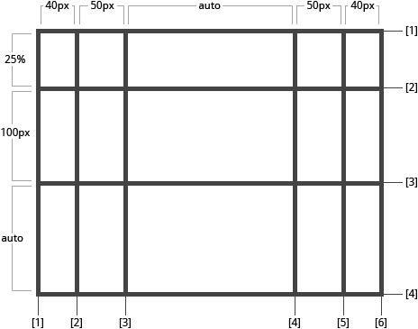

##### 4.1.2.2 场景2-显示给网格线命名
如果你想给网格线显示命名，你需要使用 **中括号** 命名

语法：

```css
.grid-container {
  grid-template-columns: [first] 40px [line2] 50px [line3] auto [col4-start] 50px [five] 40px [end];
  grid-template-rows: [row1-start] 25% [row1-end] 100px [third-line] auto [last-line];
}
```
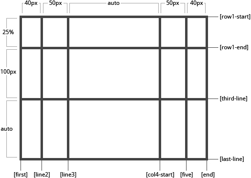

**注意：**

1. 每个网格线都可拥有多个名字，在中括号内用空格分割下。举个栗子
    
    ```css
    // 第二行网格线有两个名字 row1-end 和 row2-start
    .grid-container {
      grid-template-rows: [row1-start] 25% [row1-end row2-start] 25% [row2-end];
    }
    ```
2. 定义的属性若包含重复部分，可使用 `repeat()` 方法来简写

    ```css
    .grid-container {
      grid-template-rows: repeat(3, 20px [col-start]) 5%;
    }
    /* 相当于 */
    .grid-container {
      grid-template-rows: 20px [col-start] 20px [col-start] 20px [col-start] 5%
    }
    ```
3. fr（the flex fraction）单位允许将轨道大小设置为网格容器自由空间(自由空间是在排除所有不可伸缩的 Grid Item 之后计算得到的)的一部分
    - 将每个 Grid Item 为 Grid Container 宽度的三分之一

    ```css
    .grid-container {
      grid-template-columns: 1fr 1fr 1fr;
    }
    ```
    - fr单位可用的自由空间总量不包括50px(即自动计算不包括50px)

    ```css
    .grid-container {
      grid-template-columns: 1fr 1fr 1fr 50px;
    }
    ```

#### 4.1.3 grid-template-areas（合并单元格）
> 小节（4.1.2）是通过 **网格轨道大小 和 网格线** 来进行布局划分一个个 **网格单元** 的
> 这节来讲讲通过 **网格单元** 来进行布局合成
> 简单来说，就是网格列均分、行均分后成一个个小的单元格，再进行小的单元格进行命名定制成特定布局

在这里：网格元素 就是 网格单元，`grid-template-areas` 是给每一个小的网格单元进行命名合并成一个网格区域

- 理解：`grid-template-areas` 属性的作用是**为 整个 网格容器 定义 网格容器布局模版**，通过对 网格单元 的命名来进行扩展 网格单元（有点类似 excel 的表格合并）
- 用法：
    + 可选值：
        + grid-area-name：指定 网格单元 的名称，形成特定网格区域
        + .：点号表示一个空的网格单元格，形成一个空的网格区域
        + none：没有 网格单元 被定义，即没有形成网格区域
    
    ```css
    .grid-container {
      grid-template-areas:  "<grid-area-name> | . | none | ..."
        "...";
    }
    ```

举个栗子：

```css
.item-a {
  grid-area: header;
}
.item-b {
  grid-area: main;
}
.item-c {
  grid-area: sidebar;
}
.item-d {
  grid-area: footer;
}

.grid-container {
  grid-template-columns: 50px 50px 50px 50px;
  grid-template-rows: auto;
  grid-template-areas: 
    "header header header header"
    "main main . sidebar"
    "footer footer footer footer";
}
```

这个栗子有点苦，首先是创建了一个 四列三行 的网格。(1)整个顶由 标题区域 组成。(2)中间一排将由两个主要区域组成，一个是空单元格，另一个是侧栏区域。(3)最后一行是所有页脚
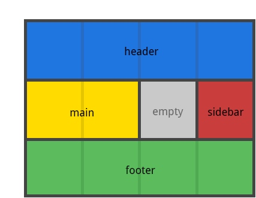

**小总结：**

- 声明的每一行都需要有相同数量的单元格
- 可使用任意数量的 . 来声明单个网格单元。若这些 . 之间没有空间，则形成了一个空的 网格区域
- 注意不是在用这个命名行，我们是对每个网格单元进行定义名字，使其形成特定的网格区域，与此同时网格区域的网格线自动命名。当使用这种语法时，网格区域两端的网格线实际上是自动命名的（若网格区域的名称为 foo，则对应起始的行网格线和列网格线名称为 foo-start，对应终结的行网格线和列网格线名称为 foo-end，即是说一个网格线可能有多个名称，如上图最左边的一条网格线有三名字header-start、main-start、footer-start）

#### 4.1.4 grid-template（简写，且不建议使用）
- 作用：grid-template-rows、grid-template-columns、grid-template-areas 的简写
- 用法：
    - 可选值：
        - none：三个属性都设置为初始值
        - grid-template-rows / grid-template-columns：把 grid-template-columns 和 grid-template-rows 设置为指定值, 与此同时, 设置 grid-template-areas 为 none
    
    ```css
    .grid-container {
      grid-template: none | <grid-template-rows> / <grid-template-columns>;
    }
    ``` 

举个栗子：

```css
.grid-container {
  grid-template:
    [row1-start] "header header header" 25px [row1-end]
    [row2-start] "footer footer footer" 25px [row2-end]
    / auto 50px auto;
}

// 等价于
.grid-container {
  grid-template-rows: [row1-start] 25px [row1-end row2-start] 25px [row2-end];
  grid-template-columns: auto 50px auto;
  grid-template-areas: 
    "header header header" 
    "footer footer footer";
}
```

**注意：** 由于 `grid-template` 不会重置隐式网格属性（`grid-auto-columns`，`grid-auto-rows` 和`grid-auto-flow`），而这可能是大多数情况下你想要做的。因此建议使用 `grid` 属性来代替`grid-template`

#### 4.1.5 grid-column-gap && grid-row-gap（网格线的大小）
- 作用：设置网格线的尺寸大小，可理解成间距。只在行列之间生成，不在外部的边缘生成
- 用法：
    - 可选值：line-size，长度值

    ```css
    .grid-container {
      grid-column-gap: <line-size>;
      grid-row-gap: <line-size>
    }
    ```

举个栗子：

```css
.grid-container {
  grid-template-columns: 100px 50px 100px;
  grid-template-rows: 80px auto 80px; 
  grid-column-gap: 10px;
  grid-row-gap: 15px;
}
```
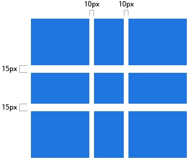

#### 4.1.6 grid-gap（网格线的大小，简写）
- 作用：`grid-column-gap` 和 `grid-row-gap` 的简写形式
- 用法：
    - 可选值：grid-row-gap grid-column-gap（长度单位）
      
    ```css
    .grid-container {
      grid-gap: <grid-row-gap> <grid-column-gap>
    }
    ```

举个栗子：

```css
.grid-container {
  grid-template-columns: 100px 50px 100px;
  grid-template-rows: 80px auto 80px; 
  grid-gap: 10px 15px;
}
```

**注意：**若没有指定 `grid-row-gap`，则默认与 `grid-column-gap` 的值相同


#### 4.1.7 grid-auto-columns && grid-auto-rows
- 作用：指定所有自动生成的网络轨道（又名隐式网络轨道）的大小
- 触发条件：隐式网格轨道在您明确定位超出定义网格范围的行或列（通过grid-template-rows/grid-template-columns）时被创建
- 用法：
    - 可选值：`<track-size>` 可以是一个长度值，一个百分比值，或者一个自由空间的一部分（使用 fr 单位） 
    
    ```css
    .grid-container {
      grid-auto-columns: <track-size> ...;
      grid-auto-rows: <track-size> ...;
    }
    ```
##### 4.1.7.1 举个栗子
思考如下代码：

```css
.gird-container {
  grid-template-columns: 60px 60px;
  grid-template-rows: 90px 90px
}
```

上述代码创建了 2 行 2 列的网格，如图所示
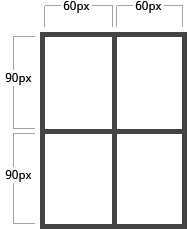

**问题来了**：但你如果使用 `gird-column` 和 `grid-row` 来定位网格元素，如下代码所示

```css
.item-a {
  grid-column: 1 / 2;
  grid-row: 2 / 3;
}
.item-b {
  grid-column: 5 / 6;
  grid-row: 2 / 3;
}
```

那么变成了
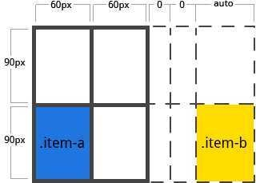

**发现问题**：指定的 `.item-b` 开始于列网格线5，结束列网格线6。但我们明显没有定义列网格线 5 或 6。因为我们引用了不存在的网格线，宽为 0 的隐式轨道的就会被创建用于填补空隙。这时候就可以使用 `grid-auto-columns` 和 `grid-auto-rows` 来指定这些隐式轨道的宽度，看如下代码：

```css
.grid-container {
  grid-auto-columns: 60px;
}
```
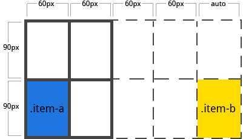

#### 4.1.8 grid-auto-flow（填充方式）
- 作用：用于控制自动布局算法的工作方式
- 用法：
    - 可选值：
        - row：告诉自动布局算法依次填充每行，根据需要添加新行
        - column：告诉自动布局算法依次填入每列，根据需要添加新列
        - dense：告诉自动布局算法，若出现稍小的 网格元素，尝试在网格中更早地填充空洞（该属性值可能导致乱序）
    
    ```css
    .grird-container {
      grid-auto-flow: row | column | row dense | column dense
    }
    ```
##### 4.1.8.1 举个栗子    
思考如下代码：

```html
<section class="grid-container">
  <div class="item-a">item-a</div>
  <div class="item-b">item-b</div>
  <div class="item-c">item-c</div>
  <div class="item-d">item-d</div>
  <div class="item-e">item-e</div>
</section>
```

```css
.grid-container {
  display: grid;
  grid-template-columns: 60px 60px 60px 60px 60px;
  grid-template-rows: 30px 30px;
  grid-auto-flow: row;
}
```
上述代码创建了 5 行 2 列的网格，并且 `grid-auto-flow` 为 `row`

指定 网格元素 放在网格上，只为两个 网格元素指定位置

```css
.item-a {
  grid-column: 1;
  grid-row: 1 / 3;
}
.item-e {
  grid-column: 5;
  grid-row: 1 / 3;
}
```

此时，如图所示：
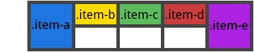

**问题来了**：把 `grid-auto-flow` 改为 `column`，如图所示：

```css
.grid-container {
  display: grid;
  grid-template-columns: 60px 60px 60px 60px 60px;
  grid-template-rows: 30px 30px;
  grid-auto-flow: column;
}
```
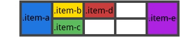

#### 4.1.9 grid（属性简写）
- 作用：在单个声明中设置所有以下属性的简写（grid-template-rows、grid-template-columns、grid-template-areas、grid-auto-rows、grid-auto-columns、grid-auto-flow）**与此同时，grid-column-gap 和 grid-row-gap 设置为它们的初始值，即便不能设置它们的值，但是可以为所欲为**
- 用法：
    - 可选值：
        - none：所有子属性设置为初始值
        - grid-template-rows / grid-template-columns：为 `grid-template-rows` 和 `grid-template-columns` 分别设置指定值，其余属性设置为初始值
        - grid-auto-flow [grid-auto-rows [ / grid-auto-columns] ] ：为 `grid-auto-flow`、`grid-auto-rows`、`grid-auto-columns`指定值。若省略 `grid-auto-columns`，则将其设置为 `grid-auto-rows`。若两者省略，则被设置为它们的初始值
        
    ```css
    .grid-container {
        grid: none | <grid-template-rows> / <grid-template-columns> | <grid-auto-flow> [<grid-auto-rows> [/ <grid-auto-columns>]];
    }
    ```
    
举个栗子：

```css
.grid-container {
  grid: 200px auto / 1fr auto 1fr;
}
/* 等效于 */
.grid-container {
  grid-template-rows: 200px auto;
  grid-template-columns: 1fr auto 1fr;
  grid-template-areas: none;
}

.grid-container {
  grid: column 1fr / auto;
}
/* 等效于 */
.grid-container {
  grid-auto-flow: column;
  grid-auto-rows: 1fr;
  grid-auto-columns: auto;
}
```

复杂点的最简单栗子描述：

```css
.grid-container {
  grid: [row1-start] "header header header" 1fr [row1-end]
        [row2-start] "footer footer footer" 25px [row2-end]
        / auto 50px auto;
}

.grid-container {
  grid-template-areas: 
    "header header header"
    "footer footer footer";
  grid-template-rows: [row1-start] 1fr [row1-end row2-start] 25px [row2-end];
  grid-template-columns: auto 50px auto;    
}
```
总结：很复杂，入门先单个单个写

#### 4.1.10 对齐方式相关的属性（针对多个网格区域）
上述所讲的都是 Grid Container 布局生成的相关属性，这后面讲的是 Grid Container 布局对齐的相关属性

1. justify-items
2. align-items
3. justify-content
4. align-content

##### 4.1.10.1 justify-items（相对网格区域行轴对齐）
- 作用：沿着 **行轴**（可理解成 x 轴）对齐网格区域内的内容，该值使用于容器内的所有的网格元素 （Grid Item）。
- 对齐对象：内容是相对于网格单元形成的网格区域的对齐
- 对应的：沿着 **列轴** 对齐网格内的内容是 **align-items**
- 用法：
    - 可选值：
        - start：内容对齐到网格区域的 **左端**
        - end：内容对齐到网格区域的 **右端**
        - center：内容对齐到网格区域的 **中心**
        - stretch（默认）：**拉伸网格区域的整个宽度**

    ```css
    .grid-container {
      justify-items: start | end | center | stretch;
    }
    ```

###### 4.1.10.1.1 举个栗子
看如下代码效果：

```css
/* 左对齐 */
.grid-container {
  justify-items: start;
}
```
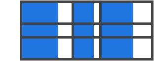


```css
/* 右对齐 */
.grid-container {
  justify-items: end;
}
```
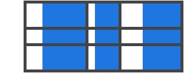


```css
/* 中心对齐 */
.grid-container {
  justify-items: center;
}
```
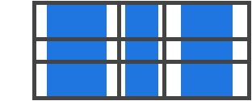

```css
/* 默认对齐，即拉伸对齐 */
.grid-container {
  justify-items: stretch;
}
```
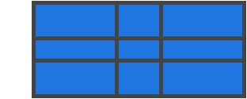

**注意：**这种对齐方式，也可使用 `网格元素` 的属性 **justify-self** 单独设置给网格元素上，使其对齐方式发生变化

##### 4.1.10.2 align-items（相对网格区域列轴对齐）
- 作用：沿着 **列轴**（可理解成 y 轴）对齐网格内的内容，该值使用于容器内的所有的网格元素 （Grid Item）
- 对应的：沿着 **行轴** 对齐网格内的内容是 **justify-items**
- 用法：
    - 可选值：
        - start：内容对齐到网格区域的 **顶端**
        - end：内容对齐到网格区域的 **底端**
        - center：内容对齐到网格区域的 **中心**
        - stretch（默认）：**拉伸网格区域的整个宽度**

    ```css
    .grid-container {
      align-items: start | end | center | stretch;
    }
    ```
    
###### 4.1.10.2.1 举个栗子
看如下代码效果：
  
```css
/* 顶对齐 */
.grid-container {
  align-items: start;
}
```
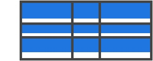

```css
/* 底对齐 */
.grid-container {
  align-items: end;
}
```
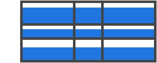


```css
/* 中心对齐 */
.grid-container {
  align-items: center;
}
```
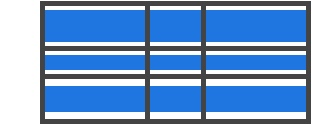

```css
/* 拉伸对齐 */
.grid-container {
  align-items: stretch;
}
```


**注意：**这种对齐方式，也可使用 `网格元素` 的属性 **align-self** 单独设置给网格元素上，使其对齐方式发生变化

##### 4.1.10.3 justify-content（相对网格容器行轴对齐）
- 作用：设置网格区域相对网格容器内的对齐方式
- 与 `justify-items` 的区别：`justify-content` 在 **网格单元形成的网格区域的行总宽度小于网格容器宽度** 时起作用。若 **网格单元形成的网格区域的行总宽度大于等于网格容器宽度**，则无区别
- 触发条件：类似所有 网格单元 是使用 px 单位（非弹性）来设置大小，导致形成的网格区域的宽度小于网格容器宽度，就有可能发生这种情况
- 用法：
    - 可选值：
        - start：**网格区域** 对齐在 **网格容器**的 **左端**
        - end：**网格区域** 对齐在 **网格容器**的 **右端**
        - center：**网格区域** 对齐在 **网格容器**的 **中心**
        - stretch：**网格区域 拉伸网格容器的整个宽度**
        - space-around：**网格区域 之间设置相等大小的空白间隙，但其两端的间隙大小为中间空白间隙大小的一半**
        - space-between：**网格区域 之间设置相等大小的空白间隙，但其两端的间隙大小没有**
        - space-evenly：**网格区域 之间设置相等大小的空白间隙，但其两端的间隙大小为中间空白间隙大小一样大**

    ```css
    .grid-container {
      justify-content: start | end | center | stretch | space-around | space-between | space-evenly;
    }
    ```
###### 4.1.10.3.1 举个栗子
看如下代码效果：

```css
/* 网格区域相对网格容器左对齐 */
.grid-container {
  justify-content: start;
}
```
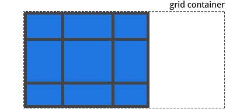

```css
/* 网格区域相对网格容器右对齐 */
.grid-container {
  justify-content: end;
}
``` 
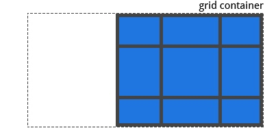

```css
/* 网格区域相对网格容器中心对齐 */
.grid-container {
  justify-content: center;
}
``` 
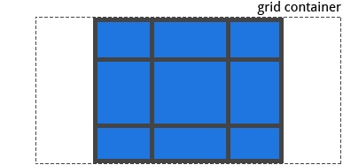

```css
/* 网格区域相对网格容器拉伸对齐，拉伸网格区域的宽度 */
.grid-container {
  justify-content: stretch;
}
``` 
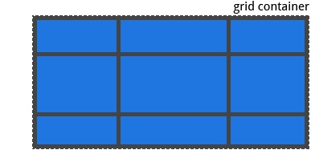

```css
/* 网格区域相对网格容器两端对齐，但两端的空白间隙是网格区域间的一半 */
.grid-container {
  justify-content: space-around;
}
``` 
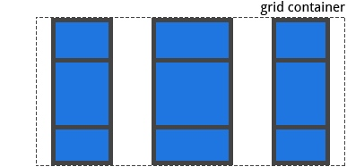

```css
/* 网格区域相对网格容器两端对齐，但两端的空白间隙没有 */
.grid-container {
  justify-content: space-between;
}
``` 


```css
/* 网格区域相对网格容器两端对齐，但两端的空白间隙和网格区域间大小一样大 */
.grid-container {
  justify-content: space-evenly;
}
``` 
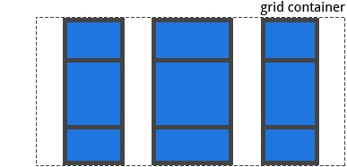

##### 4.1.10.4 align-content（相对网格容器列轴对齐）
- 与 小节4.1.10.3 同理，只是相对**行轴对齐**，换成**列轴对齐**
- 触发条件：类似所有 网格单元 是使用 px 单位（非弹性）来设置大小，导致形成的网格区域的**高度**小于网格容器**高度**，就有可能发生这种情况
- 用法：
    - 可选值：
        - start：**网格区域** 对齐在 **网格容器**的 **顶端**
        - end：**网格区域** 对齐在 **网格容器**的 **底端**
        - center：**网格区域** 对齐在 **网格容器**的 **中心**
        - stretch：**网格区域 填充网格容器的整个高度**
        - space-around：**网格区域 之间设置相等大小的空白间隙，但其两端的间隙大小为中间空白间隙宽度的一半**
        - space-between：**网格区域 之间设置相等大小的空白间隙，但其两端的间隙大小没有**
        - space-evenly：**网格区域 之间设置相等大小的空白间隙，但其两端的间隙大小为中间空白间隙大小一样大**

    ```css
    .grid-container {
      align-content: start | end | center | stretch | space-around | space-between | space-evenly;
    }
    ```
###### 4.1.10.4.1 举个栗子
看如下代码效果：

```css
/* 网格区域相对网格容器顶对齐 */
.grid-container {
  align-content: start;
}
```
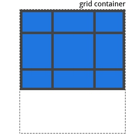

```css
/* 网格区域相对网格容器底对齐 */
.grid-container {
  align-content: end;
}
```
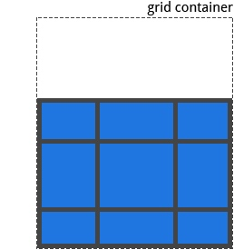

```css
/* 网格区域相对网格容器中心对齐 */
.grid-container {
  align-content: center;
}
```
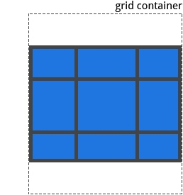

```css
/* 网格区域相对网格容器拉伸对齐，拉伸网格区域的高度 */
.grid-container {
  align-content: stretch;
}
```
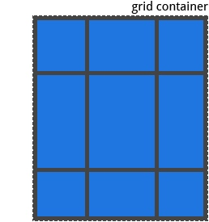

```css
/* （两端指顶端和底端）网格区域相对网格容器两端对齐，但两端的空白间隙是网格区域间的一半 */
.grid-container {
  align-content: space-around;
}
```
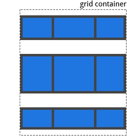

```css
/* （两端指顶端和底端）网格区域相对网格容器两端对齐，但两端的空白间隙没有 */
.grid-container {
  align-content: space-between;
}
```


```css
/* （两端指顶端和底端）网格区域相对网格容器两端对齐，但两端的空白间隙和网格区域间大小一样大 */
.grid-container {
  align-content: space-evenly;
}
```


### 4.2 网格元素（Grid Item）的全部属性
1. grid-column-start && grid-column-end
2. grid-row-start && grid-row-end
3. grid-column && grid-row
4. grid-area
5. justify-self
6. align-self

#### 4.2.1 grid-\*-start && grid-\*-end
- 作用：指定特定的网格线来确定网格区域在网格容器内的位置
- 网格区域的起始线：`grid-column-start/grid-row-start`
- 网格区域的终结线：`grid-column-end/grid-row-end`
- 用法：
    - 可选值：
        - `<line>`：用一个数字来引用一个编号的网格线，或一个名字来引用一个命名的网格线
        - `span <number>` ：设置**跨越指定数量**的网格轨道
        - `span <name>`：跨越一些轨道，直到碰到**设置指定命名的网格线**
        - `auto`：自动布局，或自动跨域，或跨域默认一个轨道

    ```css
    .grid-item {
      grid-column-start: <number> | <name> | span <number> | span <name> | auto
      grid-column-end: <number> | <name> | span <number> | span <name> | auto
      grid-row-start: <number> | <name> | span <number> | span <name> | auto
      grid-row-end: <number> | <name> | span <number> | span <name> | auto
    }
    ```
    
##### 4.2.1.1 举个栗子
看如下代码效果：

```css
.gird-item-a {
  grid-column-start: 2;
  grid-column-end: five;
  grid-row-start: row1-start
  grid-row-end: 3
}
```
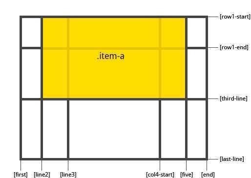

```css
.grid-item-b {
  grid-column-start: 1;
  grid-column-end: span col4-start;
  grid-row-start: 2
  grid-row-end: span 2
}
```
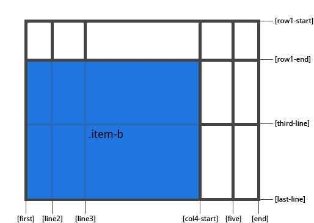

**注意：**

  1. 若没声明 `grid-*-end`，则默认跨越1个轨道
  2. 网格区域可以相互堆叠，且可使用 `z-index` 来控制层级

#### 4.2.2 grid-column && grid-row（简写）
- grid-column：grid-column-start 和 grid-column-end 的简写形式
- grid-row：grid-row-start 和 grid-row-end 的简写形式
- 用法：`<start-line> / <end-line>`

```css
.grid-item {
  grid-column: <start-line> / <end-line> | <start-line> / span <value>;
  grid-row: <start-line> / <end-line> | <start-line> / span <value>;
}
```

##### 4.2.2.1 举个栗子
看如下代码效果：

```css
/* 没有指定结束行值，默认跨一个轨道*/
.grid-item-c {
  grid-column: 3 / span 2;
  grid-row: third-line / 4;
}
```
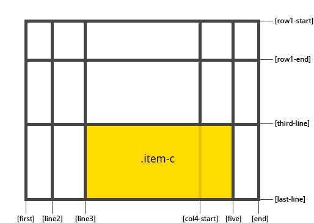


#### 4.2.3 grid-area
- 作用：
    1. 为 网格元素 进行命名，以让网格容器的 `grid-template-areas` 属性创建布局模版时引用
    2. 可作为 `grid-row-start / grid-column-start / grid-row-end / grid-column-end` 的简写形式
- 用法：
    - 可选值：
        - `<name>`：网格元素的命名
        - `<row-start> / <column-start> / <row-end> /<column-end>` ：可以是数字，也可以是网格线的名字

```css
.grid-item {
  grid-area: <name> | <row-start> / <column-start> / <row-end> / <column-end>;
}
```

##### 4.2.3.1 举个栗子
看如下代码效果：

```css
/* 给一个网格元素命名*/
.grid-item-d {
  grid-area: header
}

/* 或写成网格线的形式*/
.grid-item-d {
  grid-area: 1 / col4-start / last-line / 6
}
```
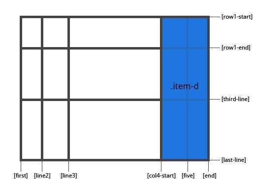

#### 4.2.4 对齐方式相关的属性（针对单个网格区域）
上述所讲的都是 Grid Item 布局生成的相关属性（关于网格线，网格区域命名的属性），这后面讲的是 Grid Item 布局对齐的相关属性

1. justify-self
2. align-self

##### 4.2.4.1 justify-self（相对网格区域行轴对齐，单个）
- 作用：沿着行轴对齐网格区域内的内容
- 用法：
    - 可选值：
        - start：内容对齐到网格区域的 **左端**
        - end：内容对齐到网格区域的 **右端**
        - center：内容对齐到网格区域的 **中心**
        - stretch（默认）：**填充网格区域的整个宽度**
           
    ```css
    .grid-item {
      justify-self: start | end | center | stretch;
    }
    ```
###### 4.2.4.1.1 举个栗子
看如下代码效果：

```css
/* 左对齐 */
.grid-item-a {
  justify-self: start;
}
```
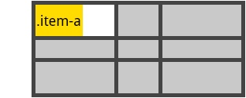

```css
/* 右对齐 */
.grid-item-a {
  justify-self: end;
}
```
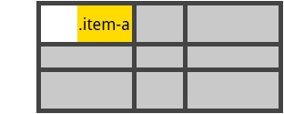

```css
/* 中心对齐 */
.grid-item-a {
  justify-self: center;
}
```
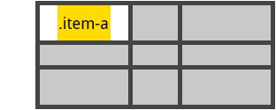

```css
/* 中心对齐 */
.grid-item-a {
  justify-self: stretch;
}
```
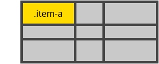

##### 4.2.4.2 align-self（相对网格区域列轴对齐，单个）
- 作用：沿着列轴对齐网格区域内的内容
- 用法：
    - 可选值：
        - start：内容对齐到网格区域的 **顶端**
        - end：内容对齐到网格区域的 **底端**
        - center：内容对齐到网格区域的 **中心**
        - stretch（默认）：**填充网格区域的整个宽度**

    ```css
    .grid-item {
      align-self: start | end | center | stretch;
    }
    ```

###### 4.2.4.2.1 举个栗子
看如下代码效果：

```css
/* 顶对齐 */
.grid-item-a {
  align-self: start;
}
```
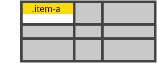

```css
/* 底对齐 */
.grid-item-a {
  align-self: end;
}
```
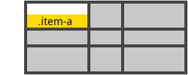

```css
/* 中心对齐 */
.grid-item-a {
  align-self: center;
}
```
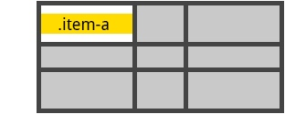

```css
/* 拉伸对齐 */
.grid-item-a {
  align-self: stretch;
}
```
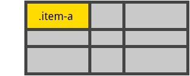


