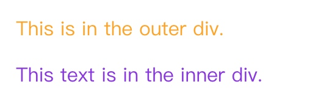

# 2 优先级、继承和级联
## 2.1 优先级
1. 认识：浏览器通过 **优先级** 来判断哪一些属性值与一个元素最为相关，从而在元素上应用这些属性值
2. 定义：优先级是基于不同种类选择器组成的匹配规则

### 2.1.1 优先级的计算
1. 优先级就是分配给指定的 CSS 声明的一个值，由匹配的选择器中的每种选择器类型的数量决定
2. 当多个声明具有相同的优先级时，CSS 中的最后一个声明会被应用到元素上
3. 当同一个元素有多个声明时，优先级才有意义
    + 每个直接用于元素的 CSS 规则始终优先于该元素从祖先元素继承而来的规则
    + **文档树中元素的接近度对优先级没有影响**

### 2.1.2 选择器类型
- 下面列表中，选择器的优先级时递增的
    1. 类型选择器(如 `h1`) 和 伪元素选择器(如 `::before`)
    2. 类选择器(如 `.container`)、属性选择器(如 `[type="radio"]`)、伪类选择器(如 `:hover`)
    3. ID 选择器(如 `#id`)
- 通配选择器(如 `*`)、关系选择器(如 `+`、`>`、`～`、' ')、否定伪类选择器对优先级没有影响
    + 在 `:not()` 内部声明的选择器会影响优先级
- 元素添加的内联样式(如：`style="color: #f00"`)总会覆盖外部样式表的任何样式，可看作最高的优先级

#### 2.1.2.1 !important
- 当一个样式声明中使用一个 `!important` 规则时，此声明覆盖其它任何声明
    + 虽然技术上 `!important` 与优先级无关，但它与它直接相关
    + 使用 `!important` 是个坏习惯，尽量避免使用
    + 两条带有 `!important` 规则的声明被应用到相同的元素上时，拥有更大的优先级的声明被使用
- 一些经验
    + 一定要优先考虑样式规则的优先级而不是用 `!important`
    + 永远不要在 你的组件中 使用 `!important`

- 什么时候使用 `!important`
    + 网站上有一个设定了全站样式的 CSS 文件
    + 写了一些很差的内联样式
    
#### 2.1.2.2 :not 伪类选择器
- `:not()` 否定伪类在优先级计算中不会被
    + 在计算选择器数量时，还是会把其中的选择器当作普通选择器进行计数

- 示例：

    ```html
    div.outer p {
      color:orange;
    }
    div:not(.outer) p {
      color: blueviolet;
    }
    
    <div class="outer">
      <p>This is in the outer div.</p>
      <div class="inner">
        <p>This text is in the inner div.</p>
      </div>
    </div>
    ```
    

#### 2.1.2.3 基于形式的 选择器
- 优先级是基于选择器的形式进行计算的
- 示例：
    分析：虽然 选择器 `*[id="foo"]` 选择了一个 ID，但还是作为属性选择器来计算自身的优先级。没有 ID 选择器优先级高

    ```html
    * #foo {
      color: green;
    }
    *[id="foo"] {
      color: purple;
    }
    <p id="foo">I am a sample text.</p>
    ```
    

#### 2.1.2.4 无视 DOM 树中的距离
 - 示例：
    
    ```html
    body h1 {
      color: green;
    }
    html h1 {
      color: purple;
    }
    
    <html>
    <body>
      <h1>Here is a title!</h1>
    </body>
    </html>
    ```
    

#### 2.1.2.5 直接给目标元素添加样式和目标元素继承样式对比
- 为目标元素直接添加样式，永远比继承样式的优先级高，无视优先级的遗传规则
- 示例
    分析：h1 选择器明确的定位到了元素，但绿色选择器的仅仅继承其父级
    ```html
    #parent {
      color: green;
    }
    h1 {
      color: purple;
    }
    
    <html>
    <body id="parent">
      <h1>Here is a title!</h1>
    </body>
    </html>
    ```
    
