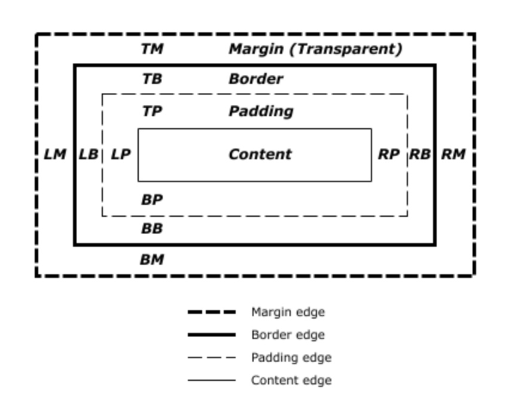

# 4. 布局和包含块（Layout and The Containing Block）
## 1 概念
1. 定义：一个元素的尺寸和位置经常受 **包含块（The Containing Block）** 影响。大多数情况下，**包含块(The Containing Block)** 就是这个元素最近的祖先 **块级元素(Block Level)** 的 **内容区(Content Area)**，但也不总是这样

2. 示例图：当浏览器展示一个文档的时候，每一个元素都会生成一个盒子。每个盒子都被划分成四个区域
    + 内容区(Content Area)
    + 填充区(Padding Area)
    + 边界区(Border Area)
    + 隔离区(Margin Area)：意为元素的隔离间隙
    

误区理解：
1. 很多开发者认为 **一个元素的包含块** 就是 **它父元素的内容区**，但事实并非如此

## 2 包含块的影响
元素的尺寸和位置常常受它的包含块的影响。对于一些 CSS 属性，如 width、height、padding、height、绝对定位元素(position 被设置为 absolute 或 fixed)的偏移值，**我们对这些属性设置为 百分比 时**，这些值的计算值是由元素的包含块决定

## 3 确定包含块

- 方法：确定**一个元素的包含块**的过程完全依赖于**这个元素的 position 属性**
    1. 若 `position` 的值为 `static` 或 `relative`，包含块就是由它的最近的祖先**块容器(a block container)**(如 inline-block、block、list-item element), 和**形成格式化上下文的元素**(如 table container、flex container、grid container、the block container itself)，的**内容区**的边缘组成(the edge of the content box)
        + 疑问???(content box 指的是什么，与 box-sizing 的关系)
    2. 若 `position` 的值为 `absolute`，包含块由它最近的祖先元素(其 **position 的值非 static**，也就是 relative、absolute、fixed、sticky)，的**填充区的边缘**组成
    3. 若 `position` 的值为 `fixed`，包含块由 **视口**(在**连续媒体**的情况下) 或 **页面区域**(在**分页媒体**的情况下)
    4. 若 `position` 的值为 `absolute` 或 `fixed`，包含块也可能由它最近的祖先元素的**填充区的边缘**组成。最近的祖先元素需要满足的条件如下：
        + 值不为 `none` 的 `transform` 属性 或值不为 `none` 的 `perspective` 属性
        + 值为 `transform` 或 `perspective` 的 `will-change` 属性
        + 值不为 `none` 属性的 `filter` 属性
        + 特殊：值为 `filter` 的 `will-change` 属性(仅在火狐下)

- 注意：根元素 `<html>` 的包含块是一个被称为 **初始包含块(the initial containing block)** 的 矩形。它具有 视口(连续媒体) 或 页面区域(分页媒体) 的尺寸

## 4 从包含块计算百分比
- 如上所诉，当一个元素的某些属性的属性值设置为**百分比**时，**计算值**(the computed value) 取决于该元素。

- 这些属性有**盒模型属性**和**偏移属性**：
    1. 要计算 `height`、`top`、`bottom` 的百分比值，是通过 **包含块的高** 决定的
        + 若包含块(包含块的 `position` 的值为 `relative` 或 `static`)的高是依赖于内容的变化，则这些值为 0
    2. 要计算 `width`、`left`、`right`、`padding`、`margin` 的百分比值，是通过 **包含块的宽** 决定的

## 5 实践测试
以下示例都使用该 html 代码段

```html
<body>
  <section>
    <p>This is a paragraph!</p>
  </section>
</body>
```
### 5.1 示例1
场景：自身元素 position 属性 为 static || relative 
1. css 代码

    ```css
    body {
      background: beige;
    }
    
    section {
      display: block;
      width: 400px;
      height: 160px;
      background: lightgray;
    }
    
    p {
      width: 50%;   /* == 400px * .5 = 200px */
      height: 25%;  /* == 160px * .25 = 40px */
      margin: 5%;   /* == 400px * .05 = 20px */
      padding: 5%;  /* == 400px * .05 = 20px */
      background: cyan;
    }
    ```
2. 分析：p 元素的 `position` 为 `static`，所以它的包含块为 `section`。
    + 原因：距离最近的祖先元素 `section` 是一个 **块容器(a block container)**

### 5.2 示例2
场景：祖先元素不再是块容器
1. css 代码

    ```css
    body {
      background: beige;
    }
    
    section {
      display: inline;
      background: lightgray;
    }
    
    p {
      width: 50%;     /* == half the body's width */
      height: 200px;  /* Note: a percentage would be 0 */
      background: cyan;
    }
    ```
2. 分析：p 元素的包含块为 `body` 元素
    + 原因：`section` 不再是一个块容器，并且没有形成一个格式化上下文

### 5.3 示例3
场景：自身元素 `position`为 `absolute`，且最近的祖先元素的 `position` 为 `absolute`
1. css 代码

    ```css
    body {
      background: beige;
    }
    
    section {
      position: absolute;
      left: 30px;
      top: 30px;
      width: 400px;
      height: 160px;
      padding: 30px 20px;
      background: lightgray;
    }
    
    p {
      position: absolute;
      width: 50%;   /* == (400px + 20px + 20px) * .5 = 220px */
      height: 25%;  /* == (160px + 30px + 30px) * .25 = 55px */
      margin: 5%;   /* == (400px + 20px + 20px) * .05 = 22px */
      padding: 5%;  /* == (400px + 20px + 20px) * .05 = 22px */
      background: cyan;
    }
    ```
1. 分析：p 元素的包含块为 `section` 元素
    + 原因：自身元素 `position` 为 `absolute`，最近的祖先元素 `section` 的 `position` 为 `absolute`.
        + p 元素的 **百分比值** 会受到 **包含块的 padding** 影响
        + 若 **包含块的 box-sizing** 值设置为 `border-box`，就没有该问题

### 5.4 示例4
场景：自身元素的 `position` 为 `fixed`

1. css 代码

    ```css
    body {
      background: beige;
    }
    
    section {
      width: 400px;
      height: 480px;
      margin: 30px;
      padding: 15px;
      background: lightgray;
    }
    
    p {
      position: fixed;
      width: 50%;   /* == (50vw - (width of vertical scrollbar)) */
      height: 50%;  /* == (50vh - (height of horizontal scrollbar)) */
      margin: 5%;   /* == (5vw - (width of vertical scrollbar)) */
      padding: 5%;  /* == (5vw - (width of vertical scrollbar)) */
      background: cyan;
    }
    ```
    
2. 分析：p 元素的包含块为 初始包含块（在屏幕上，即 viewport），尺寸就随浏览器窗框大小变化而变化
    + 原因：自身元素的 `position` 为 `fixed`
    
### 5.5 示例5
场景：自身元素的 `position` 为 `absolute`，最近的祖先元素的 `transform` 的属性值不为 `none`

1. css 代码

    ```css
    body {
      background: beige;
    }
    
    section {
      transform: rotate(0deg);
      width: 400px;
      height: 160px;
      background: lightgray;
    }
    
    p {
      position: absolute;
      left: 80px;
      top: 30px;
      width: 50%;   /* == 200px */
      height: 25%;  /* == 40px */
      margin: 5%;   /* == 20px */
      padding: 5%;  /* == 20px */
      background: cyan;
    }
    ```
    
2. 分析：p 元素的包含块为 `section` 元素
    + 原因：自身元素的 `position` 属性值为 `absolute`，距离最近的祖先元素的 `transform` 属性值不为 `none`

